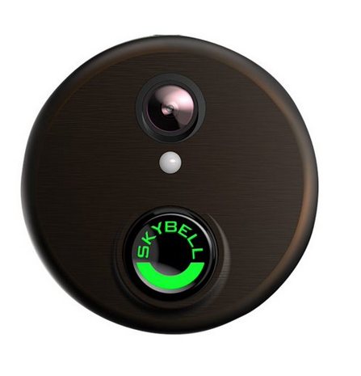
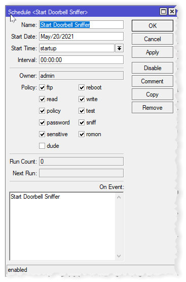

# Simple-Skybell-Sniffer

## Instantly Have A Skybell Button Press Wirelessly Run Any Script or Trigger Any Action in Home Assistant or Node-Red 


 

- ## No Homebridge Required

- ## Support for Mikrotik Routers Added (v. 0.30)

## Description

For a somewhat dated but detailed description on hardware and software setup see my blog entry [How to Have Skybell Ring a Virtual Doorbell Using Skybell Sniffer](https://geekvisit.com/updating-an-old-music-sound-intercom-system-with-skybell-hd-part-2-of-2-or-how-to-have-skybell-ring-a-doorbell-without-wires-using-skybell-sniffer/).  The entry illustrates setup with a DD-WRT flashed router using the 0.21 release of this service. Configuration is slightly different from what is shown in the blog entry (e.g., on 0.30 and above you will need to set the SNIFFER variable to "tcpdump' for use with DD-WRT flashed routers.)

` SkyBell is a trademark owned by SkyBell Technologies, Inc. This project is not endorsed or in anyway affiliated with Skybell.`

# Requirements

- a Linux server (e.g., a Raspberry Pi) AND
- EITHER
  - a router which permits ssh access (e.g., routers that use custom DD-WRT firmware)
    OR
  - a [Mikrotik](https://mikrotik.com/) router running RouterOS. As of May 2021, this has been tested on Mikrotik's Hap Ac2 router running version 6.48.2 of RouterOS

# How it Works

This service is to be installed on a Raspberry Pi or other Linux box. It listens for the Skybell button push by sniffing your router traffic. Once the Service detects the Skybell's button push, it runs any custom command(s).

# Why Use It ?

- No existing doorbell, an electronic chime that is incompatible with Skybell, or can't hook up your Skybell to your existing doorbell wiring ? No problem, this will allow you to wirelessly detect the button press and play an mp3 of a doorbell ringing.
- Make your doorbell (or motion detection) trigger any command you wish.
- Publish an MQTT message to any topic and have [HomeAssistant](https://www.home-assistant.io/), [Node-RED](https://nodered.org/) or any similar IOT software respond. For example, you can cast to your Google Home Devices when someone presses the doorbell or have the Google Assistant announce "You have a visitor at your door"
- Send custom telegram notifications to your phone using the [Telegram CLI](https://github.com/vysheng/tg).

For me this [solved a problem of an old Music & Sound doorbell and intercom system](https://geekvisit.com/updating-an-old-music-sound-intercom-system-with-skybell-hd-part-2-of-2-or-how-to-have-skybell-ring-a-doorbell-without-wires-using-skybell-sniffer/) that was incompatible with a hard wired connection with Skybell. I connected the system's transformer to the Skybell for power, then used this Service to detect the doorbell press and play an mp3 recording of a doorbell sound over Google Assistant speakers. I didn't have to replace or install transformers or do any major rewiring.

## Installation


### DD-WRT or Other Routers Permitting SSH

1. On a Raspberry Pi (or other Linux machine) save the files to appropriate locations. On my Raspberry Pi running the Buster version of Raspbian using `systemd` the files are copied to the following locations:

| File                    | Location                                                                      |
| ----------------------- | ----------------------------------------------------------------------------- |
| `skybell-sniff.pl`      | `/usr/local/bin/skybell-sniff.pl` (or an alternative location of your choice) |
| `skybell-sniff.service` | `/etc/systemd/system/skybell-sniff.service`                                   |
| `skybell-sniff`         | `/etc/default/skybell-sniff`                                                  |

The included `install-skybell-sniff.sh` bash file will install the indicated files in the above locations.

### Configure `/etc/systemd/system/skybell-sniff.service`

The following configuration options may need to be tweaked:

| Option      | Description                                                                                                                                                                                                                      |
| ----------- | -------------------------------------------------------------------------------------------------------------------------------------------------------------------------------------------------------------------------------- |
| `ExecStart` | If the Perl script has been saved to an alternative location then update the path to match.                                                                                                                                      |
| `User`      | Username that will run the service. If you have a Mikrotik router and wish to use non-root username Wireshark will need to be configured to add the user to the Wireshark group - see the comments in skybell-sniff for details. |

### Configure `/etc/default/skybell-sniff`

Modify the following environment variables as appropriate:

| Variable       | Examples                        | Description                                                                |
| -------------- | ------------------------------- | -------------------------------------------------------------------------- |
| `SKYBELL_HOST` | The IP address of the doorbell. |
| `SKYBELL_NAME` | `'Doorbell'`                    | The name of the doorbell within the SkyBell HD app.                        |
| `ROUTER_HOST`  | `192.168.0.1`                   | The IP address of the gateway/router.                                      |
| `ROUTER_USER`  | `root`                          | The `ssh` username for connecting to the gateway/router to run `tcpdump`.  |
| `SNIFFER`      | `tshark` OR `tcpdump`           | Set to `tshark` for mikrotik routers, `tcpdump` for routers requiring ssh. |

`SNIFFER_CMD_TSHARK` and `SNIFFER_CMD_TCPDUMP` may also be modified as needed but recommend trying the default settings first.

### DD-WRT Or Other Routers Permitting SSH (other than Mikrotik)

1. Set the `SNIFFER` Variable to `tcpdump`
2. Configure the router to allow `ssh` login without a password, (e.g. by adding your public key to its `authorized_keys` file).

### Mikrotik Routers

1. Set the `SNIFFER` Variable to `tshark`
2. On the Raspberry Pi or other Linux server you are installing this service to, install [tshark](https://tshark.dev/setup/install/) (the command line version of wireshark).
3. In your Mikrotik router settings add the following script (Using WinBox: System->Scripts, click the plus sign and copy and paste this into the script text box):

```
delay 10
/tool sniffer
set file-limit=10KiB file-name=doorbell.pcap filter-direction=tx \
    filter-interface=wlan-2GHZ filter-ip-address=192.168.0.xxx \
    filter-ip-protocol=udp filter-operator-between-entries=and filter-stream=\
    yes memory-limit=1000KiB streaming-enabled=yes streaming-server=\
    192.168.0.xxx

/tool sniffer start
```

Use the IP address of your Skybell and the IP address of your server running the Skybell-Sniffer in place of the above values in `filter-ip-address` and `streaming-server` respectively. The `filter-interface` should also match the name of the wireless interface your Skybell is using.

3. Run the script.

4. Set a schedule task to run the script on the Mikrotik's router bootup: Winbox, System->Scheduler->Plus sign. Settings should be similar to the following:

 


5. Open port 37008 on your Linux box by typing `ufw allow 37008` or equivalent using another firewall tool. This is the port that your Mikrotik router will stream to and on which tshark will listen. You can modify this port by editing the `SNIFFER_CMD_TSHARK` variable in skybell-sniff.

# How to Ring a Bell, Trigger any script, and/or Use with Home Assistant

In `/etc/default/skybell-sniff`, set SKYBELL_CMD_ACTION to a script you want to run. For instance, set it to a bash script such as `/home/homeassistant/skybell-actions.sh`. An example script is included.

The bash script can then play an mp3 file of a bell ringing, or do anything else you want.

To use with [Home Assistant](https://www.home-assistant.io/) see the example included `skybell-actions.sh` which publishes an mqtt topic which then can be detected by a sensor in HomeAssistant.

### So `skybell-actions.sh` would have:

```
mosquitto_pub -h [mqtt broker ip] -p [mqtt broker port] -t skybell/doorbell/state -m "Ringing"
mosquitto_pub -h [mqtt broker ip] -p [mqtt broker port] -t skybell/motion/state -m "Detected"
sleep 2
mosquitto_pub -h [mqtt broker ip] -p [mqtt broker port] -t skybell/doorbell/state -m "OFF"
mosquitto_pub -h [mqtt broker ip] -p [mqtt broker port] -t skybell/motion/state -m "OFF"
```

### And your Home Assistant configuration.yaml would have:

```
#Under Sensor:
- platform: mqtt
    name: "mqtt_skybell_doorbell"
    state_topic: "skybell/doorbell/state"
    qos: 1

#Under Automation:

 - alias: Doorbell
    trigger:
      platform: state
      entity_id: sensor.mqtt_skybell_doorbell
      from: 'OFF'
      to: 'Ringing'
    action:
      - service: media_player.play_media
        data:
          entity_id: media_player.family_room_speaker
          media_content_id: "https://[your server].duckdns.org:443/doorbell1.mp3"
          media_content_type: 'audio/mp3'
```

# Starting and Stopping Skybell Sniffer

Start the doorbell sniffer process using:

```
sudo systemctl daemon-reload
sudo systemctl start skybell-sniff
sudo systemctl enable skybell-sniff
```

The following commands can be used to control and monitor the process:

| Command                                | Description                                                           |
| -------------------------------------- | --------------------------------------------------------------------- |
| `sudo systemctl daemon-reload`         | Re-read `/etc/systemd/system/skybell-sniff.service` after any changes |
| `sudo systemctl start skybell-sniff`   | Start the process now                                                 |
| `sudo systemctl stop skybell-sniff`    | Stop the process                                                      |
| `sudo systemctl enable skybell-sniff`  | Start process automatically at boot                                   |
| `sudo systemctl disable skybell-sniff` | Prevent the process from being automatically started                  |
| `sudo systemctl status skybell-sniff`  | Check status                                                          |
| `journalctl -u skybell-sniff -f`       | Monitor activity                                                      |


## Background/History


This is a slightly modified version of the [Homebridge Webhooks Sniffer](https://github.com/thoukydides/homebridge-skybell/wiki/Webhooks-Sniffer) without the Homebridge stuff, and is a fork of [thoukydides's](https://github.com/thoukydides) [gist](https://gist.github.com/thoukydides/27eb6abd1bb84c78f2f9a4f0d9d111a2) containing the sniffer component files.

This fork does not require HomeBridge and allows you to trigger events (like playing mp3 files or executing shell scripts) when Skybell is pressed. There are methods to detect a Skybell press by logging into Skybell's servers but it is painfully slow. This sniffer allows a response time within a second or two. See Thoukydides' project for a Homebridge Skybell plugin for a detailed [explanation](https://github.com/thoukydides/homebridge-skybell/).

The sniffer can't read the encrypted messages going between Skybell and its AWS servers but it can detect the package length which is enough to detect the button presses.

This project takes only those scripts from the Thoukydides project which need to run the basic sniffer without Homebridge and makes some revisions to get the sniffer working (I found I had to edit the package order to find the trigger for a button push - see the explanation [here](https://github.com/thoukydides/homebridge-skybell/wiki/Protocol-CoAP) from Thoukydides). For some reason his script did use some other method to detect button presses but it did not work for me (to see my changes do a diff of skybell-sniff.pl ).

### NOTE:

> Release 0.30 of the Simple Skybell Sniffer adds Mikrotik compatibility. I needed to add Mikrotik support as I replaced my old Netgear router flashed with DD-WRT with a Mikrotik HaP AC2 router. After replacing my DD-WRT router, I have not gone back and tested it with DD-WRT. As a result, if DD-WRT does not work, try the [0.21](https://github.com/GeekVisit/Simple-Skybell-Sniffer/releases/tag/0.21) Release. 
